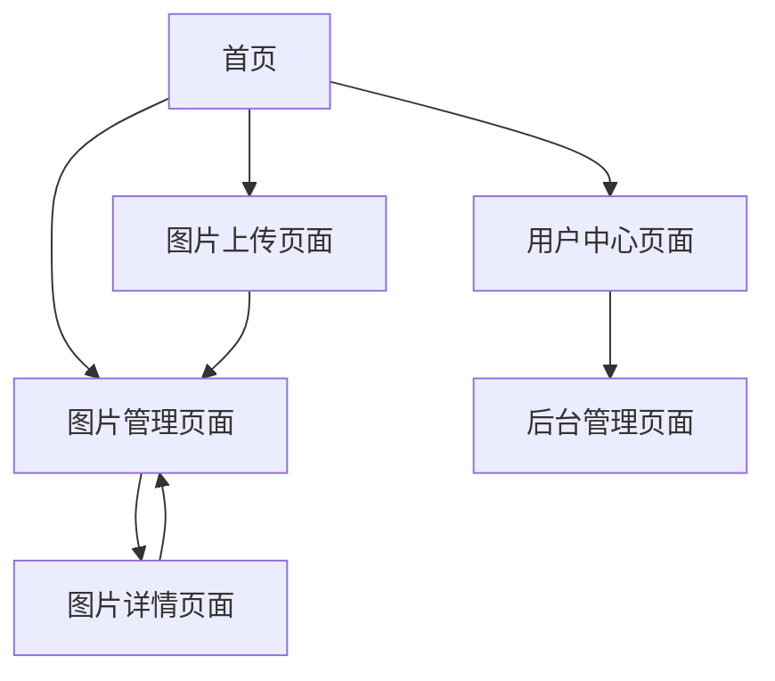

# 图床系统产品需求文档

## 1. 产品概述
一个基于 Web 的图片托管服务系统，为用户提供图片上传、存储、管理和分享功能。系统自动生成多种尺寸的图片版本，满足不同场景的使用需求。
- 目标用户包括个人用户、开发者和内容创作者，提供稳定的图片存储和分享服务。
- 核心价值在于自动生成多尺寸图片优化加载性能，提供统一的图片管理后台和简单易用的 API 接口。

## 2. 核心功能

### 2.1 用户角色
| 角色 | 注册方式 | 核心权限 |
|------|----------|----------|
| 普通用户 | 邮箱注册 | 上传、查看、管理自己的图片 |
| 管理员 | 系统分配 | 管理所有用户和图片，系统配置 |

### 2.2 功能模块
我们的图床系统需求包含以下主要页面：
1. **首页**：用户登录入口、系统介绍、快速上传功能
2. **图片管理页面**：图片列表展示、搜索筛选、批量操作
3. **图片上传页面**：单张/批量上传、拖拽上传、上传进度显示
4. **图片详情页面**：图片信息展示、编辑、分享链接生成
5. **用户中心页面**：个人信息管理、存储统计、API Key 管理
6. **后台管理页面**：系统仪表盘、用户管理、系统配置

### 2.3 页面详情
| 页面名称 | 模块名称 | 功能描述 |
|----------|----------|----------|
| 首页 | 登录模块 | 用户邮箱/用户名登录，JWT Token 认证，记住登录状态 |
| 首页 | 快速上传 | 支持拖拽上传，显示上传进度，基本图片预览 |
| 图片管理页面 | 图片列表 | 网格/列表视图切换，分页显示，按时间排序 |
| 图片管理页面 | 搜索筛选 | 按名称、标签搜索，批量选择操作 |
| 图片上传页面 | 上传功能 | 单张/批量上传(最多20张)，支持JPG/PNG/GIF/WebP格式 |
| 图片上传页面 | 图片处理 | 自动生成原图、大图(1920px)、中图(800px)、小图(300px) |
| 图片详情页面 | 图片信息 | 显示图片详情，编辑名称、描述、标签 |
| 图片详情页面 | 分享功能 | 生成分享链接，设置有效期，访问密码保护 |
| 用户中心页面 | 个人信息 | 用户信息管理，密码修改，邮箱验证 |
| 用户中心页面 | 使用统计 | 存储空间使用情况，上传统计，API Key 管理 |
| 后台管理页面 | 系统仪表盘 | 存储使用情况，上传统计，热门图片，系统状态监控 |
| 后台管理页面 | 用户管理 | 用户列表，权限管理，存储限制配置 |

## 3. 核心流程

**普通用户流程：**
用户首先在首页进行登录或注册，登录成功后可以通过快速上传功能或进入图片上传页面上传图片。上传的图片会自动处理生成多个尺寸版本。用户可以在图片管理页面查看所有图片，通过搜索和筛选功能快速找到目标图片。点击图片可进入详情页面查看完整信息、编辑图片属性或生成分享链接。用户可以在用户中心查看个人信息和使用统计。

**管理员流程：**
管理员除了拥有普通用户的所有功能外，还可以访问后台管理页面。在后台可以查看系统整体运行状况、管理所有用户账户、配置系统参数如存储限制等。

## 4. 用户界面设计

### 4.1 设计风格
- 主色调：蓝色系 (#2563eb)，辅助色：灰色系 (#64748b)
- 按钮样式：圆角按钮，悬停效果，主要按钮使用渐变色
- 字体：系统默认字体，标题 18-24px，正文 14-16px
- 布局风格：卡片式布局，顶部导航栏，左侧边栏(管理页面)
- 图标风格：线性图标，简洁现代，支持暗色模式

### 4.2 页面设计概览
| 页面名称 | 模块名称 | UI 元素 |
|----------|----------|----------|
| 首页 | 登录模块 | 居中卡片式登录框，蓝色主按钮，输入框圆角设计 |
| 首页 | 快速上传 | 虚线边框拖拽区域，上传进度条，缩略图预览网格 |
| 图片管理页面 | 图片列表 | 响应式网格布局，悬停放大效果，操作按钮浮层 |
| 图片上传页面 | 上传功能 | 大尺寸拖拽区域，文件列表，实时进度显示 |
| 图片详情页面 | 图片信息 | 左右分栏布局，图片预览区，信息编辑表单 |
| 用户中心页面 | 个人信息 | 标签页切换，统计图表，设置表单 |
| 后台管理页面 | 系统仪表盘 | 数据卡片，图表展示，状态指示器 |

### 4.3 响应式设计
系统采用桌面优先的响应式设计，在移动端进行适配优化。支持触摸交互，图片上传支持移动端拍照功能。